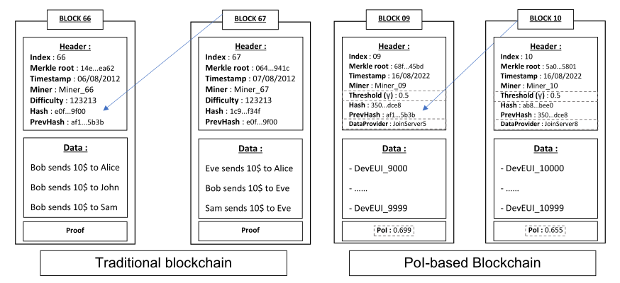
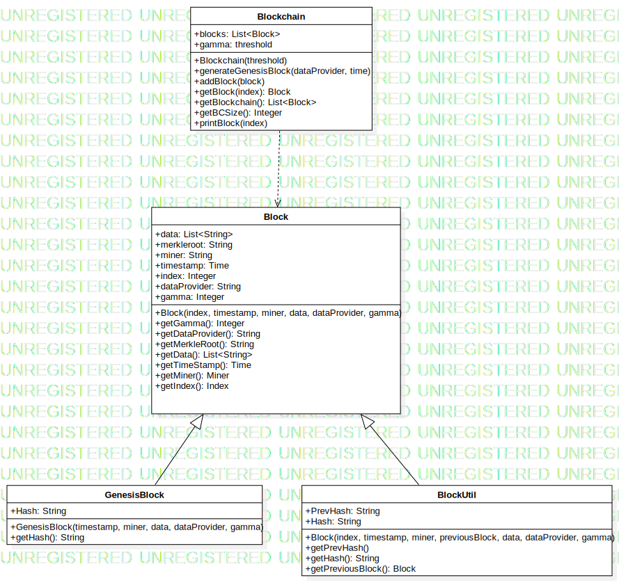
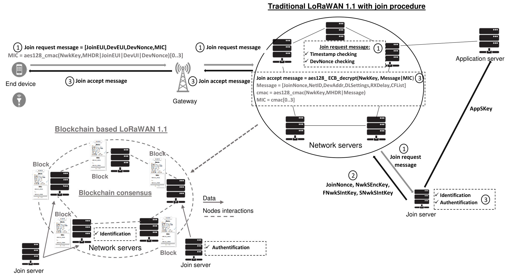

# ProofOfIdentification-based Blockchain
## PoI-based blockchain
This package provides an implementation of the PoI-based blockchain. This is a new model for LoRaWAN join procedure.

Main contact: Lounès Meddahi (lounes.meddahi@gmail.com)
## Overview
The PoI-based blockchain is a blockchain based on a trust index associated with each full node in the blockchain network and an overall threshold. When the trust index (a value between 0 and 1) of a complete node is lower than the threshold, the node is **definitely** banned from the blockchain network. As the node's trust index is added to the blockchain when it adds a new block to the blockchain, other full nodes can easily reject the block mined by such a node.
In the case of LoRaWAN, if a network server has allowed too many illegitimate devices to connect, its trust index will fall below the threshold and it will be banned.

In order to get such a blockchain, we adapted the classic blockchain scheme.

  

## Implementation
To implement the blockchain, we distinguished between the two possible block types (genesis block and classic block). We have provided an object-oriented implementation in python. 

  

## Pre-requisites
Before deploying the blockchain, you need to define a blockchain network. In the case of PoI-based blockchain for LoRaWAN, the users of the blockchain network (the nodes) are the network servers. In this repository, we do not propose an easy installation of such an architecture.
To use our PoI-based blockchain implementation, you need to define the communication rules between users to spread the blockchain. An implementation for the LoRaWAN case is available on GitHub.

  

